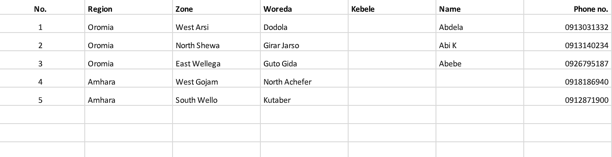
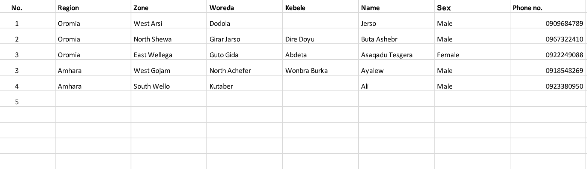

### Farmstack Implementation PAD

#### Data Source - AI Tech Data
 

 

#### Data Source - Farmer Data 
 

 

## The above project consist of two component
Please follow the below steps
 1. Provider
    To run provider node
        change directory to IDSA-FS-DEMO/configs
        run $docker-compose -f docker-compose-provider.yaml up
         
 2. Consumer
    To run the consumer node
        Change directory to IDSA-FS-DEMO/configs
        run $docker-compose -f docker-compose-consumer.yaml up

#### The above configuration is build to run on a single machine.

- To separate provider and consumer on distributed instance :
    ### add following lines in the respective files
    
    a. docker-compose-provider.yaml
        extra_hosts:
            - "consumer-core:your-consumer-machine-ip"
            
    b. docker-compose-consumer.yaml
        extra_hosts:
            - "provider-core:your-provider-machine-ip"
        

