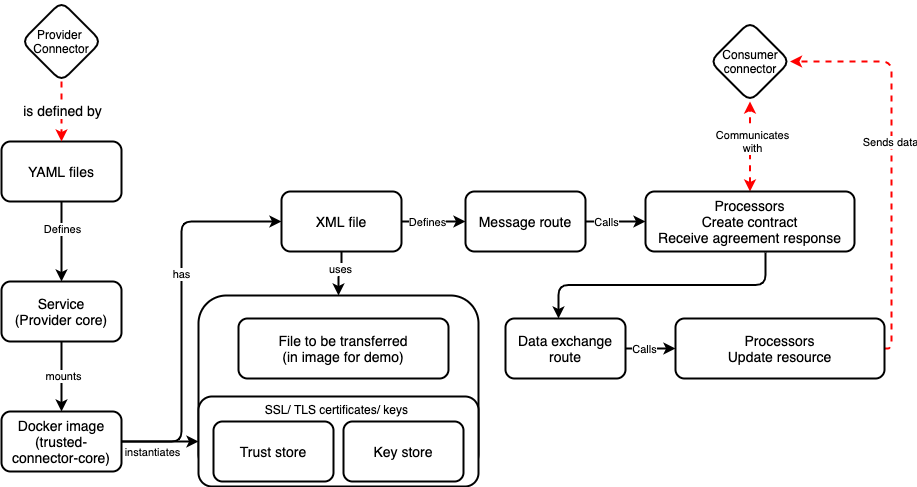

# Farmstack example implementation

## Description
This project is a reference inmplementation of farmstack. There is one provider and one consumer, both running a FarmStack p2p connector. The connectors mutually authenticate and encrypt data through the SSL certificates provided to them from a simulated certificate authority. 

The data provider has two sample csv files in the format as provided by PAD, uploaded in a google sheet [here]( https://docs.google.com/spreadsheets/d/1zrf4L7xoQ5MN76wM4T84WyWSmQFI6oA9/edit#gid=1033715415). The connector is a fork from [trusted connector](https://github.com/industrial-data-space/trusted-connector/) provided by IDSA - Fraunhofer, the stack on which FarmSTakc is built on. The data consumer receives the data in IDS protocol (a secured web socket protocol developed by Fraunhofer). It has a node application running within the conatiner of the p2p connector that renders and dsiplays the data in html format (browser).

The code provided here lets run both the connectors on same machine. The section below gives description of how to run the connectors as it is and how to separarte them on distirbuted instances of data provider and consumer.

### Structure

Config/ 
 - Includes the configuration related files 
 - for example: 
        To configure application container on provider connector, change into docker-compose-provider, 
        To change the routing configurations, change into respective xml files.
        
 
Src/ 
 - Includes the application code 
 - provider-apps: contains the application related to provider connector
 - Consumer-apps: contains the application related to consumer connector
 

cert stores/
 - Includes the certificate files issued by certificate authority

### To run conenctors on single machine

1. Provider
    To run provider node
        change directory to IDSA-FS-DEMO/configs
        run $docker-compose -f docker-compose-provider.yaml up
         

2. Consumer
    To run the consumer node
        Change directory to IDSA-FS-DEMO/configs
        run $docker-compose -f docker-compose-consumer.yaml up
         

 ### To run connectors separately on provider and consumer
 
  #### add following lines in the respective files
   
   a. docker-compose-provider.yaml 
        extra_hosts:
            - "consumer-core:your-consumer-machine-ip"
            
   b. docker-compose-consumer.yaml
        extra_hosts:
            - "provider-core:your-provider-machine-ip"
        

