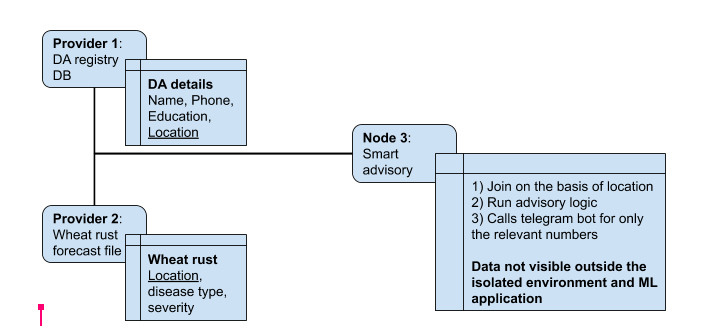
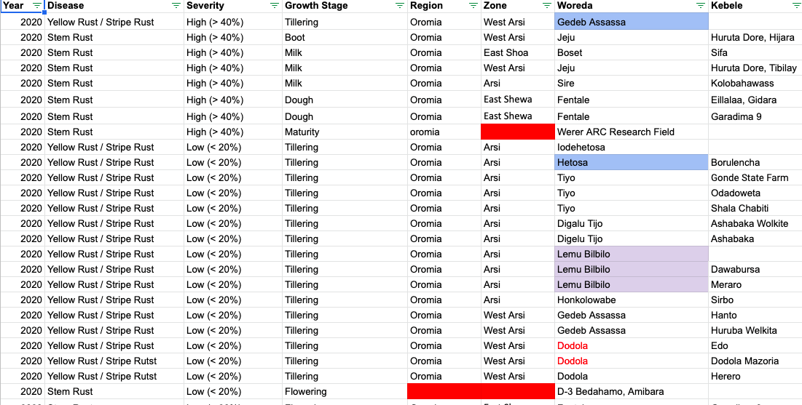
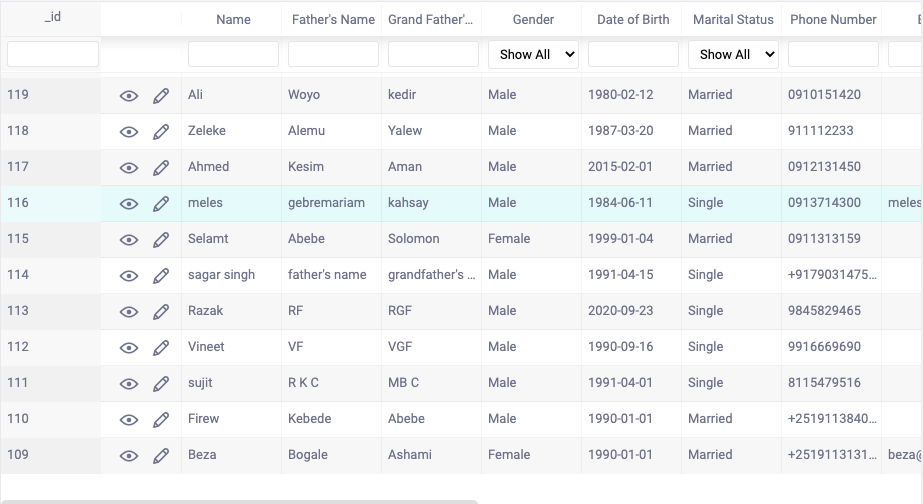

Send data to the provider with the following `wget` command:
`wget -O- --post-file Wheatqualitycertification_MonitoringSample.csv --header "Content-Type: text/csv" http://localhost:8989/postCsv`
- ### Farmstack Architecture : A secure workspace

#### Data Source - Wheat Rust
 

 

#### Data Source - DA 
 

 